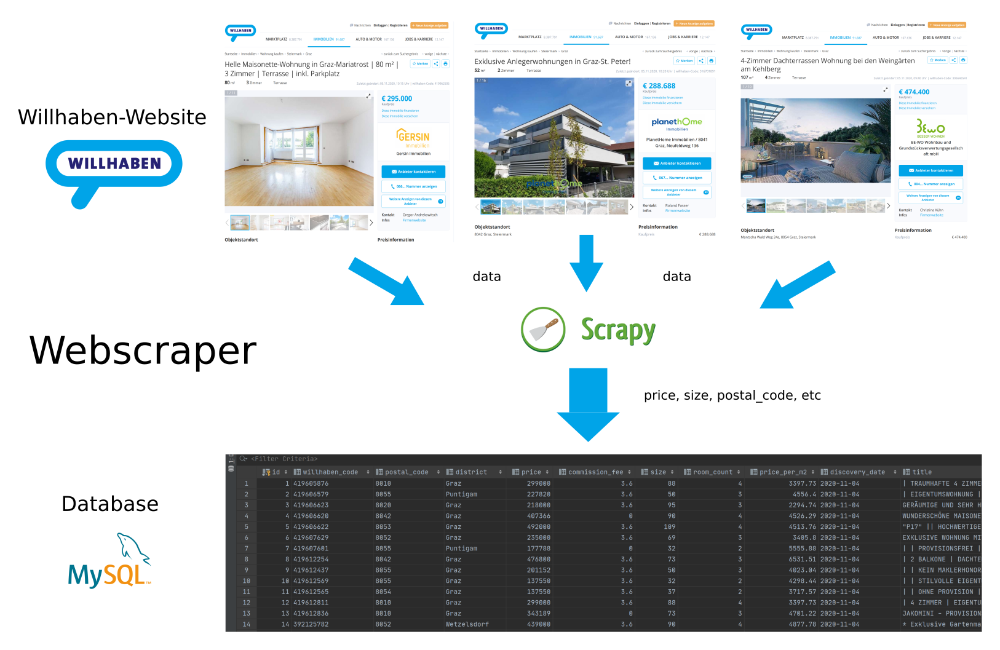
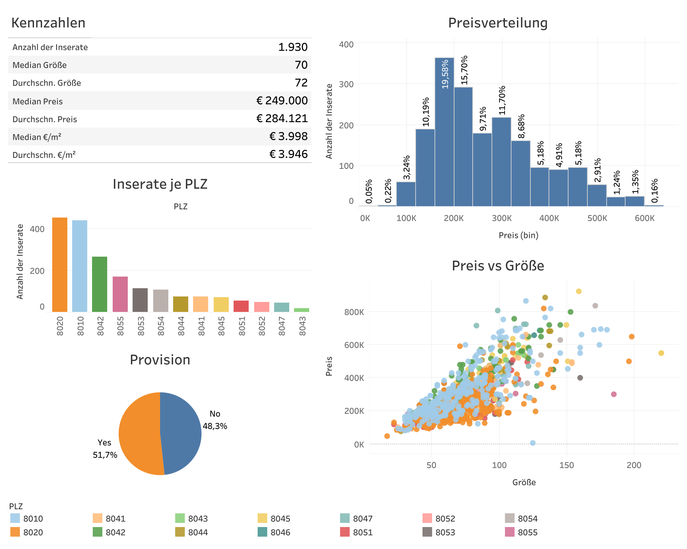
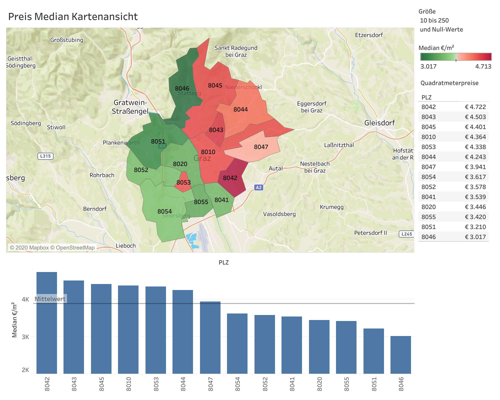

# Webscraper for Sophie :ant:

This is a small webscraper application, which I wrote to do a market research
on the condo prices in my hometown :house: (Graz, Styria, Austria).

The webscraper crawls the [Willhaben](www.willhaben.at) website, extracts the
relevant data and stores it in a local database as shown in the following figure:



The data can be used in various ways. I did a small market research in
Tableau, which is not included in this project, but I'd like to provide a
teaser of the results: :chart_with_upwards_trend:




## Prerequisites

Make sure **Docker-Compose** is installed on your machine. See
[Install Docker Compose](https://docs.docker.com/compose/install/)

Note for Ubuntu users:

1. Install Docker as descriped [here](https://docs.docker.com/engine/install/ubuntu/)
2. Do the [post install steps](https://docs.docker.com/engine/install/linux-postinstall/)
3. Install Docker-Compose as descriped [here](https://docs.docker.com/compose/install/)

## :rocket: Usage

The `docker-compose.yml` file will start two docker containers
(one for the webscraper and one for the MySQL database) and can be used like
this:

1. Open a new terminal window and type the following commands

```bash
git clone https://github.com/michaelhaar/webscraper_sophie.git

# cd into the repository
cd webscraper_sophie
```

2. **Build the containers**. The following command will download
   the base images (Python + MySQL) from the internet and install some packages
   inside the webscraper container.

```bash
docker-compose build		# may take a few minutes
```

3. We can **start the containers** and immediately run the webscraper
   application with

```bash
docker-compose up			# starts the docker containers
```

4. Verify that the webscraper is working properly by viewing the output of the
   webscraper in the terminal window. It should print out the extracted items.

Note: It's very likely that the webscraper application isn't working anymore
because willhaben changes the HTML of their website from time to time.
Please feel free to contact me or create a new issue if you need something.

5. Access the results, which were extracted and then inserted into the database.
   You can use your favorite MySQL Client for this step. (I'm using
   [DataGrip](https://www.jetbrains.com/de-de/datagrip/)).

- host=`localhost`
- port=`3306`
- The login credentials can be found in the `.env` file.

## Hints

The following commands might be useful

```bash
# Build the docker containers
docker-compose build

# Start the docker containers
docker-compose up

# Bash into the webscraper container
docker-compose run --rm webscraper bash

# Manually start the webscraper application,
# when bashed into the webscraper container
scrapy crawl willhaben

# Re-build PIP requirements
docker-compose run --rm webscraper pip-compile requirements/requirements.in

```

## Author

👤 **Michael Haar**

- LinkedIn: [@michaelhaar](https://www.linkedin.com/in/michaelhaar/)
- Github: [@michaelhaar](https://github.com/michaelhaar)
- Email: michael.haar@gmx.at
